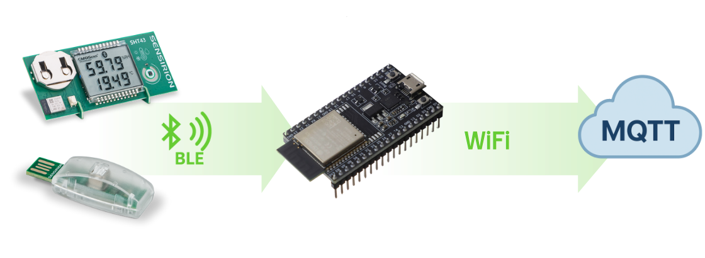

# BLE 2 MQTT
A simple BLE to MQTT relay using Unified Prototyping Toolkit (UPT) libraries. The goal is to relay BLE measurements from Sensirion gadgets to an MQTT server to be collected and further analyzed. Such device can be used in SmartHome scenarios for example.

## Get started
To get started with this sample code, follow the steps:
1. Install and open `Visual Studio Code` with the `PlatformIO` extension.
2. Download/clone the repository to your computer.
3. Open the project folder into `PlatformIO`.
4. Customize the target board inside the `platformio.ini` file.
5. Modify the script to add correct WiFi and MQTT information
7. Flash the firmware

## Get further
### MQTT advanced configuration
SSL is commented out by default but can be enabled in the main script.

You can customize the MQTT message format and the function defining which topic is used. This will allow you to match any formating or structure used by your broker and application.

### More accurate timestamps for measurements
To achieve better accuracy, one could fetch the time using an NTP server and attach the measurement time to each message.

### Deep dive into UPT
To get further you can also have a look at the options offered by the 2 UPT libraries used in this example:
- [Sensirion UPT MQTT Client](https://github.com/Sensirion/arduino-upt-mqtt-client/)
- [Sensirion UPT BLE Auto Detection](https://github.com/Sensirion/arduino-upt-ble-auto-detection)